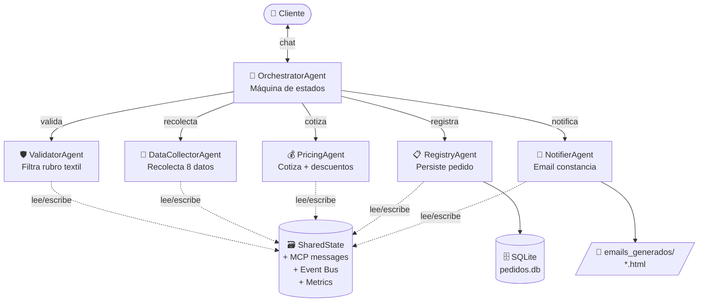
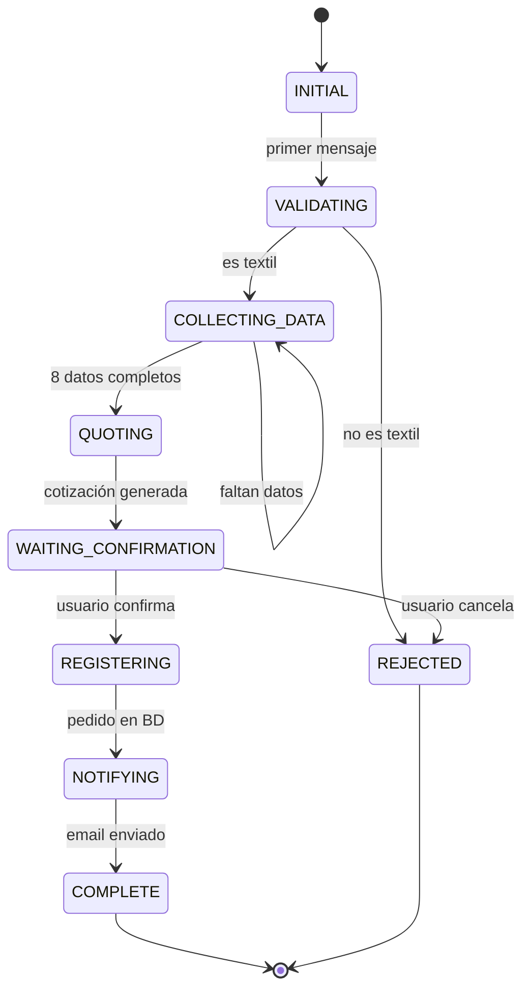

# 🧵 Fábrica de Ropa — Sistema Multiagente

> **Curso:** Automatización Inteligente de Procesos · **Grupo 01** · UPAO 2026
> Implementación en código del proceso *Realizar Pedido* del proyecto **Fábrica de Ropa**.
> Migra el flujo originalmente prototipado en N8N a un **sistema multiagente jerárquico** en Python con **LangChain LCEL + LangGraph + GitHub Models / OpenAI**.

---

## 🚀 Instalación rápida (lee primero esto)

```bash
# 1. Descomprimir y entrar
unzip fabrica_ropa_multiagente.zip
cd fabrica_ropa

# 2. Crear entorno virtual
python -m venv venv
# Linux/Mac:
source venv/bin/activate
# Windows PowerShell:
# venv\Scripts\Activate.ps1

# 3. Instalar dependencias
pip install -r requirements.txt

# 4. Configurar tu API key
copy .env.example .env       # Windows
# cp .env.example .env       # Linux/Mac
# Editar .env y pegar tu token de GitHub (o Gemini, o OpenAI)

# 5. Correr la app web (RECOMENDADO)
streamlit run app.py
# Abre http://localhost:8501

# 6. (alternativa) Correr CLI
python main.py

# 7. (alternativa) Demo automatizado
python main.py --demo

# 8. Correr tests
pytest tests/ -v
```

---

## 1. Descripción del caso

Un cliente solicita la confección de prendas (polos, camisas, uniformes, etc.). El sistema debe:

1. Validar que el pedido sea del **rubro textil**.
2. Recolectar **8 datos** del pedido vía conversación natural.
3. Generar una **cotización** con descuentos por volumen (10% / 15% / 20%) y adelanto del 50%.
4. **Registrar** el pedido en una base persistente.
5. Enviar una **constancia formal** por correo (HTML).

---

## 2. Arquitectura multiagente

**Topología:** Jerárquica tipo estrella (orquestador central + 5 subagentes especializados).



### Roles (sin solapamiento)

| Agente | Responsabilidad ÚNICA | LLM (LangChain LCEL) | Tool |
|---|---|---|---|
| **OrchestratorAgent** | Coordina el flujo. Máquina de estados. | ❌ | — |
| **ValidatorAgent** | Decide si el pedido es del rubro textil. | ✅ prompt \| llm \| parser | — |
| **DataCollectorAgent** | Conversación para extraer los 8 datos. | ✅ prompt \| llm \| parser | — |
| **PricingAgent** | Calcula subtotal, descuento, total, adelanto. | ✅ prompt \| llm \| parser | Price table |
| **RegistryAgent** | Persiste el pedido en SQLite. | ✅ prompt \| llm \| parser | SheetsTool (@tool) |
| **NotifierAgent** | Genera HTML de constancia. | ✅ prompt \| llm \| parser | EmailTool (@tool) |

### Estados del flujo



---

## 3. Comunicación entre agentes (MCP)

Los agentes intercambian **mensajes MCP estructurados** validados por **Pydantic JSON Schema**:

```json
{
  "message_id": "uuid",
  "timestamp": "2026-05-19T20:17:00",
  "sender": "OrchestratorAgent",
  "receiver": "ValidatorAgent",
  "message_type": "request",
  "payload": { "prompt": "..." },
  "correlation_id": "uuid-del-request-original"
}
```

### Mecanismos clave

- **`SharedState`** (`core/shared_state.py`): estado central thread-safe con historial MCP completo, conversación usuario↔sistema y resultados tipados de cada agente.
- **`EventBus`** (`core/event_bus.py`): pub/sub para eventos como `validation_completed`, `order_registered`. Cumple el requerimiento de "event bus" de Antigravity.
- **Resolución de conflictos**: cuando un campo se intenta sobrescribir, se detecta el conflicto y se aplica **last-write-wins** con evento auditable.
- **Memoria de conversación**: `SharedState.conversation_history` preserva todo el historial y se inyecta en los prompts.

---

## 4. Configuración del LLM (NUEVO — soporta múltiples proveedores)

El archivo `.env` controla qué proveedor LLM usar. **GitHub Models es el recomendado** (free tier muy generoso, sin tarjeta de crédito):

```ini
LLM_PROVIDER=github
LLM_API_KEY=ghp_tu_token_aqui    # ← Tu PAT de GitHub
LLM_MODEL=openai/gpt-4o-mini
LLM_API_BASE=https://models.github.ai/inference
EXECUTION_MODE=real
```

Otras opciones soportadas (ver `.env.example`):

| Proveedor | LLM_MODEL | LLM_API_BASE |
|---|---|---|
| GitHub Models | `openai/gpt-4o-mini` | `https://models.github.ai/inference` |
| Gemini | `gemini/gemini-2.0-flash` | (vacío) |
| OpenAI | `openai/gpt-4o-mini` | `https://api.openai.com/v1` |

Ver [`SETUP_GITHUB_MODELS.md`](SETUP_GITHUB_MODELS.md) para la guía paso a paso de obtener un PAT de GitHub.

---

## 5. Estructura del proyecto

```
fabrica_ropa/
├── main.py                 # Entry point CLI (chat + --demo + --metrics)
├── app.py                  # Frontend web con Streamlit (RECOMENDADO)
├── config.py               # Configuración LLM (.env)
├── requirements.txt
├── .env.example            # Plantilla de configuración
├── SETUP_GITHUB_MODELS.md  # Guía paso a paso GitHub Models
│
├── core/                   # Infraestructura del sistema
│   ├── mcp_messages.py     # Schemas MCP con Pydantic
│   ├── shared_state.py     # Estado compartido + máquina de estados
│   ├── event_bus.py        # Bus pub/sub
│   └── metrics.py          # Latencia, tokens, success rate
│
├── agents/                 # Los 6 agentes
│   ├── base.py             # Wrapper LangChain LCEL (prompt | llm | parser) + métricas + MCP
│   ├── orchestrator.py     # Coordinador (máquina de estados)
│   ├── validator.py        # Filtro rubro textil
│   ├── data_collector.py   # Recolección conversacional
│   ├── pricing.py          # Cotización
│   ├── registry.py         # Persistencia
│   └── notifier.py         # Email HTML
│
├── tools/
│   ├── sheets_tool.py      # Simula Google Sheets con SQLite
│   └── email_tool.py       # Simula Gmail con archivos HTML
│
├── data/
│   ├── price_table.json
│   ├── valid_garments.json
│   ├── pedidos.db          # (autogenerado)
│   ├── emails_generados/   # (autogenerado)
│   └── metrics.jsonl       # (autogenerado)
│
└── tests/                  # 32 tests, incluye casos adversariales
```

---

## 6. Frontend web (Streamlit)

Provee una interfaz visual completa para la defensa ante el jurado:

- **💬 Chat principal**: conversación con el orquestador.
- **Sidebar en vivo**:
  - Modo (real/mock), proveedor LLM, modelo, endpoint
  - Etapa actual del flujo (con emoji)
  - Los 8 datos del pedido con barra de progreso
  - Resultado de validación
  - Cotización detallada
  - ID del pedido registrado
  - Botón para descargar HTML de constancia
- **📊 Tab Métricas**: tabla por agente (invocaciones, éxito, latencia, tokens).
- **🔍 Tab Trazabilidad MCP**: últimos 15 mensajes MCP y eventos del Event Bus expandibles como JSON. **Oro puro para tu defensa**.
- **🔄 Botón "Nueva conversación"** para reiniciar la sesión.

```bash
streamlit run app.py
```

---

## 7. Manejo de rate limits y fallbacks

El sistema detecta automáticamente errores `429` y aplica:

1. **Retry con backoff exponencial** (2s → 4s → 8s).
2. **Fallback a modo mock por 60s** si los reintentos fallan.
3. **El estado se preserva**: aunque el LLM falle por unos turnos, el pedido sigue avanzando con extracción heurística (regex).

Forzar modo mock sin LLM:

```bash
# Windows PowerShell:
$env:EXECUTION_MODE="mock"; streamlit run app.py

# Linux/Mac:
EXECUTION_MODE=mock streamlit run app.py
```

---

## 8. Tests (32 incluidos)

```bash
pytest tests/ -v
```

Cobertura:

| Test | Caso |
|---|---|
| `test_validador_rechaza_comida` | Pedido fuera del rubro (pizzas) → rechazo correcto |
| `test_validador_rechaza_electronica` | Pedido fuera del rubro (laptop) → rechazo correcto |
| `test_validador_acepta_saludo_ambiguo` | Mensaje ambiguo → asume textil con baja confidence |
| `test_deteccion_de_conflicto` | Usuario cambia cantidad de 50 a 100 → conflicto detectado |
| `test_descuento_200_unidades` | Cantidad alta → 20% descuento aplicado |
| `test_order_data_email_invalido_falla` | Email malformado → ValidationError de Pydantic |
| `test_confirmacion_sin_datos_no_avanza` | Usuario dice "sí" sin datos → no se registra nada |
| `test_cancelacion_explicita_en_confirmacion` | Usuario cancela → estado REJECTED |
| ... | +24 tests más |

---

## 9. Mapeo a la rúbrica

| Criterio | Implementación | Archivos |
|---|---|---|
| **1. Diseño arquitectónico** (4 pts) | Topología estrella con orquestador + 5 subagentes diferenciados. Diagrama Mermaid alineado con el código. | `agents/*.py` |
| **2. Implementación LangChain** (5 pts) | Cadenas LCEL (`prompt \| llm \| parser`) con `ChatOpenAI`. Decorador `@traceable` para LangSmith. Tools con `@tool`. | `agents/base.py`, `tools/*.py` |
| **3. Comunicación MCP** (4 pts) | Mensajes MCP validados con Pydantic JSON Schema. Estado compartido thread-safe. Event bus pub/sub. Resolución de conflictos. | `core/*.py` |
| **4. Complejidad del caso** (2 pts) | Múltiples flujos condicionales, 8 etapas en máquina de estados, dominios distintos. | `agents/orchestrator.py` |
| **5. Pruebas y docs** (2 pts) | 32 tests con casos adversariales. Métricas cuantitativas. README reproducible. | `tests/`, este README |
| **6. Defensa** (3 pts) | Frontend web Streamlit + CLI + `--demo`. Tabs de trazabilidad MCP perfectas para mostrar al jurado. | `app.py`, `main.py` |

---

## 10. Equipo

- Caipo Trujillo, Sonia
- Sánchez Vargas, Daniela
- Díaz Uceda, Carlos
- Salirrosas Vasquez, Jhordy

**Docente:** Luis Vladimir Urrelo Huamán
